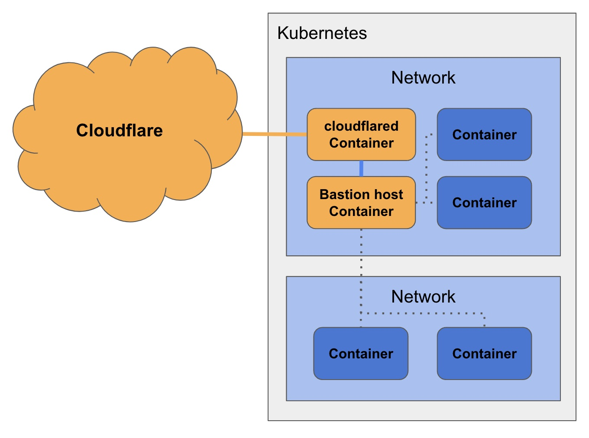

# A better way to remotely access your container servers and networks
Over the past few months I've been learning Docker and containerization. Starting with single docker images, to compose files, to Docker in swarm mode and finally learning about Kubernetes.

Along the journey I've had to investigate the networking from a containers perspective. I needed test DNS resolution from a container connected to a specific network as well as test things like reading a Swarm managed secret in a container. The simplest way to do this, was to just deploy a blank Ubuntu image, connect to the relavent Docker networks and then attach to the shell.

Also in my work I am often in need of a bastion host. This is a server with an interface exposed to the internet and used to gain access to a variety of resources on a private network. Access to the bastion must be secure so that only authorized users can then jump from the bastion host to other containers via SSH. The typical setup looks something like this...

Usually it's a Linux server with a public IP exposing an SSH service. Securing this service depends on how rushed I am or how important the resources behind it are. But usually the setup is SSH authentication with a private key (not password) and limit access to the IP/port using an allow list of IPs. This usually suffices, as most of the environments I build are not critical business systems, rather they are demonstration or test environments.

But this approach is a little painful to manage. First, I need to figure out how to securely share the SSH key information with other people on my team that need access. Then I have to manage the allowed IP range. If someone on my team is travelling or working from home, their IP might change quite often, which is a hassle to keep updating.

# Better bastion hosts with Cloudflare
There is a much easier way to do this with Cloudflare and the solution I'm about to [describe is free](https://www.cloudflare.com/plans/zero-trust-services/#)! Just sign up for a [Cloudflare account](https://dash.cloudflare.com/sign-up) and get started.

The diagram below shows how this approach is different. Instead of exposing the hosts public IP, instead we create a tunnel from a container inside your existing infrastructure, on a private network, into the Cloudflare network. Then route all requests to that host via Cloudflare.

From there we use Cloudflare's security services to protect access to the bastion host. This improves over the above solution in the following ways.
- No hosts/servers/containers are directly exposed to the internet.
- Access to the bastion host can now be defined by a tight security policy (an example of this later)
    - And the policies can be different based on the identity, location, devices of the user.
- All traffic from client to server is fully secured when you use Cloudflare WARP.
- The SSH service can be rendered in a browser, making access easier as well as secure.

Let's take a look at the specifics...

# Architecture

First step is to deploy a bastion host into your environment. There are many ways to do this, but due to the amount of times I setup test environments across providers such as Google, Azure and AWS, I wanted a quick and easy way to do it. So I built a simple [Docker image](https://hub.docker.com/) and the source is available on [github.com](https://github.com/securitypedant/).

This image is a base Ubuntu server with the following setup.
- A few basic networking tools such as ping, traceroute, dig etc.
- SSH config for easy Cloudflare remote access (explained later in this article)
- A user account in the sudo group with a default password set

I debated if the user needed to be in the sudo group, but I often need to install extra tools on the host. I will likely extend the capability of the image to allow for environment variables to control this behavior in the future.

With an image on Docker hub, it's now easy to deploy the container. But... we also need to create a secure tunnel from the bastion host to Cloudflare. Here we can use another Docker hub image, this time directly from [Cloudflare](https://hub.docker.com/) with the [cloudflared tunnel](https://developers.cloudflare.com/) software installed.

So you will be deploying two containers, one with the Cloudflare tunnel software (cloudflared) and the other is your bastion host. cloudflared creates an outbound connection back to the Cloudflare network, through which your SSH requests to the bastion host will be routed. This will make sense when you see how we setup the tunnel in a moment. 

You could, if you wanted, simply use the Cloudflare tunnel software to manage SSH connections to every other container you want access to. But for me, the bastion host is used to have an independant service from which I can test container network setup and it's also a central point I can secure further before access to any specific service.

Before we talk about deploying the containers, we need to jump into Cloudflare and do a little pre-setup.

# Creating a Cloudflare tunnel and defining the access policy

Assuming you have just signed up for Cloudflare, I will walk through the entire config. It's possible to create the tunnel and setup the access policy before building the containers.

1. Configure a DNS domain
To access the bastion host, we are going to use a public hostname, i.e. bastion-ssh.yourdomain.com. There are two ways you can do this.

- Add/move your DNS domain into Cloudflare.
- Point an existing DNS record to a Cloudflare service.

Hosting your DNS on Cloudflare is free, obviously you have to shell out for the registration but their DNS is excellent and worth using. When your DNS is hosted on Cloudflare, the required record is automatically created during tunnel setup. However, if you can't (or just don't want to) move your DNS, you will need to create a CNAME record which points to the tunnel. 

2. Create the tunnel
Now that you have DNS setup, let's create a tunnel. Login to the Cloudflare [Zero Trust dashboard](https://one.dash.cloudflare.com/) and click on the Access menu item and tunnels. Then hit "Create Tunnel"

Give the tunnel a name and hit next. You'll be presented with a screen to install the cloudflared connector. All we need from this screen is the token. Copy it from the UX, you don't need the command. Just the raw token like so.

Now we need to create a public hostname in the tunnel. This is the address that will resolve to the SSH service running on the bastion host. If you 

3. Configure the access policy

# Deploy the host as a container and tunneling to Cloudflare

Now that we have Cloudflare setup, we need to actually deploy the containers. To explain this I'll use a Docker compose file. 

    version: "3.9"
    services:
        tunnel:
            image: cloudflare/cloudflared:latest
            container_name: tunnel
            restart: always
            command: tunnel run --token <INSERT YOUR TOKEN HERE>

        bastion-host:
            image: simonsecuritypedant/bastionhost:latest
            container_name: bastionhost
            tty: true
            restart: always
            networks:
                - bastionhost
            ports:
                - 22:22
            volumes:
                - data:/data
                - ./cloudflare-ca.pub:/etc/ssh/cloudflare-ca.pub
            environment:
                - USER=simon
                - USERPASS=notagoodpassword

    volumes:
        data: {}

    networks:
        bastionhost: {}

There is a range of things to point out here.

    tunnel:
        image: cloudflare/cloudflared:latest
        container_name: tunnel
        restart: always
        command: tunnel run --token eyJhIjoiOTFjZGU087jFNasdf88ASDFjQ2NTQ4NjE4MmYyY2VhMDIiLh5FHckaLOP95mKjhGmnyasfg8752laf0mu4fnuouqwdfnnuyfg983nt4nHfh7nfV5WVdZNSJ9

This section gets the latest Cloudflare cloudflared container and gives it the name **tunnel**. Then the token you got from the Cloudflare dashboard now needs to be copied into the **command:** section. This causes the cloudflared software to connect to your account, authenticate and get the configuration. It goes without saying that this token is therefore sensitive data. In my example, i'm just throwing it into the Docker compose file. In reality you should be using a secrets manager or at the very least storing it in an **.env** file. Depending on how you plan to deploy these containers (Docker compose, Docker swarm, Kubernetes) will dictate how you manage the token securely. Note that with Docker swarm, it's not easy to pass a secret to an environment variable without doing work in the container. 

The next section

    bastion-host:
        image: simonsecuritypedant/bastionhost:latest
        container_name: bastionhost
        tty: true
        restart: always
        networks:
            - bastionhost
        ports:
            - 22:22
        volumes:
            - data:/data
            - ./cloudflare-ca.pub:/etc/ssh/cloudflare-ca.pub
        environment:
            - USER=simon
            - USERPASS=notagoodpassword

Defines the bastion host. It uses my image from Docker hub and gives it the name **bastionhost**. The container is going to create a user in the Ubuntu server and give it a password. These are set from the enviroment variables USER and USERPASS. I plan on making an upgrade to the Docker image so that it can handle the creation of multiple users.

There is also a mapping of a public key file -- **cloudflare-ca.pub** -- from the container host to the container. This is used as part of the Cloudflare configuration that uses short term lived certificates for SSH access to the bastion host. This is explained in the next section. For now, just deploy both containers and create a blank **cloudflare-ca.pub** on your container host environment and mount in the container.

You'll also notice I create a persisant volume called **/data**. I use this if I need to create any test scripts or download anything to the bastion and want it to exist after a redeployment. On my home lab, I have this **/data** volume mapped to an NFS share on my NAS so that any time I deploy the bastion host I have this data available.

Finally, note that we are publishing port 22 from the bastion host. This is so the cloudflared container can connect to the SSH service on the bastion host.

# Configuring access to the tunneled bastion host
Alright, nearly done. Now we should have two new containers running your infrastructure. If you correctly configured the cloudflared container, you will be able to see the tunnel connected in the Cloudflared dashboard.

** ADD SCREENSHOT OF DASHBOARD**

Now we need to a) create an Access app to control who can conec